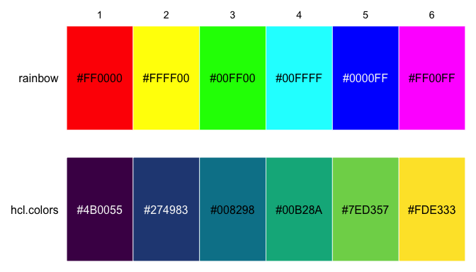
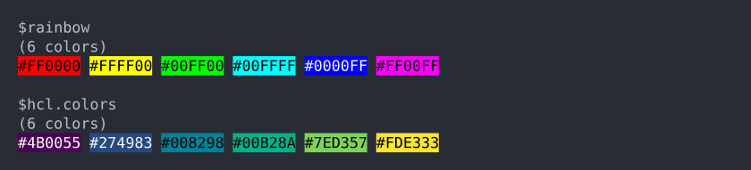
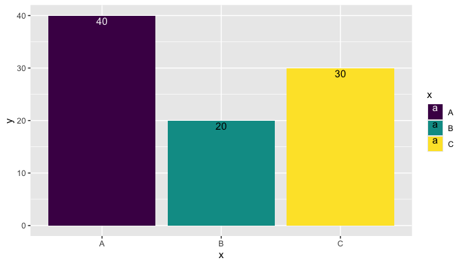
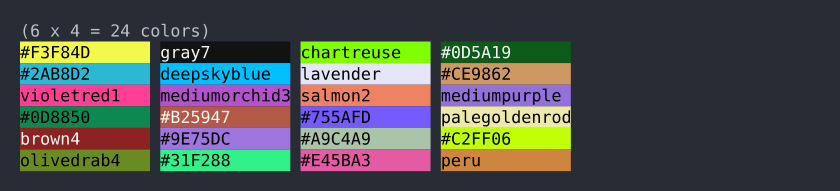

# colorkit

colorkit provides several utility functions for working with colors in
R. There are tools for converting colors to hexadecimal strings,
selecting contrasting foreground colors for a given background, randomly
sampling colors, and displaying colors visually as plotted cells or
printed console output.

This package is meant to complement and not compete with excellent
packages like [scales](https://scales.r-lib.org/) and
[farver](https://farver.data-imaginist.com/) that provide robust color
manipulation tools.

## Installation

You can install the development version of colorkit from GitHub like so:

``` r

# install.packages("pak")
pak::pkg_install("dmuenz/colorkit")
```

## Examples

Here are some examples of how you might use colorkit. First, load the
package.

``` r

library(colorkit)
```

### Visualizing color palettes

To visualize color palettes, you can use either
[`plot_color()`](https://dmuenz.github.io/colorkit/reference/plot_color.md)
or
[`print_color()`](https://dmuenz.github.io/colorkit/reference/print_color.md).
The former prints to the graphics device, the latter to the console.
Both functions accept either a vector, matrix, or list of vectors and
matrices all containing R colors. Colors can be specified using any of
the standard R color specifications.

Here’s an example of plotting two palettes with
[`plot_color()`](https://dmuenz.github.io/colorkit/reference/plot_color.md).

``` r

plot_color(list(
  rainbow = rainbow(6),
  hcl.colors = hcl.colors(6)
))
```



And here are the same palettes printed to the console with
[`print_color()`](https://dmuenz.github.io/colorkit/reference/print_color.md).

``` r

print_color(list(
  rainbow = rainbow(6),
  hcl.colors = hcl.colors(6)
))
```



For
[`print_color()`](https://dmuenz.github.io/colorkit/reference/print_color.md)
to work best, your console must support 24-bit colors; that way it can
display all 256³ colors in the hex RGB color space (i.e., colors of the
form `"#rrggbb"`). If your console does not support that many colors,
then it may (depending on your platform) map each specified color to the
closest printable color.
[`print_color()`](https://dmuenz.github.io/colorkit/reference/print_color.md)
is indebted to the [cli package](https://cli.r-lib.org/) for color
printing in the console.

## Selecting contrasting foreground colors

In the above examples, note that some color codes are printed in black
(like `#FFFF00`) while others are printed in white (`#0000FF`). The text
colors were chosen by
[`bg2fg()`](https://dmuenz.github.io/colorkit/reference/bg2fg.md) to
provide good contrast with the background, according to the methods
defined by WCAG 2.x ([contrast
ratio](https://www.w3.org/WAI/GL/wiki/Contrast_ratio), [relative
luminance](https://www.w3.org/WAI/GL/wiki/Relative_luminance)).

You can easily use
[`bg2fg()`](https://dmuenz.github.io/colorkit/reference/bg2fg.md) for
your own displays. Here’s an example of putting text within the bars of
a bar plot:

``` r

library(ggplot2)

data <- data.frame(x = LETTERS[1:3], y = c(40, 20, 30))
bg <- hcl.colors(3)

ggplot(data, aes(x, y)) +
  geom_col(aes(fill = x)) +
  geom_text(aes(label = y, color = x), vjust = 1.2) +
  scale_fill_manual(values = bg) +
  scale_color_manual(values = bg2fg(bg))
```



## Converting colors to hexadecimal strings

Occasionally it is useful to standardize the various R color
specifications into hex strings.
[`col2hex()`](https://dmuenz.github.io/colorkit/reference/col2hex.md)
does this, converting all colors to uppercase hex strings with either 6
or 8 hex digits, depending for each color on whether it’s opaque.

``` r

col2hex(c("red", "#fac", "1", "transparent"))
#> [1] "#FF0000"   "#FFAACC"   "#000000"   "#FFFFFF00"
```

Some use cases for this are:

1.  When programmatically creating HTML/CSS code in R, you can use R
    color specifications to create HTML/CSS colors. E.g., “violetred” is
    a valid color name in R but not in HTML/CSS, so you could generate
    code like
    `sprintf("<div style='background:%s;'></div>", col2hex("violetred"))`.

2.  With the `grid` package, the drawing of raster objects can be sped
    up by first converting them to hex strings. See the
    [`col2hex()`](https://dmuenz.github.io/colorkit/reference/col2hex.md)
    help page for an example.

[`col2hex()`](https://dmuenz.github.io/colorkit/reference/col2hex.md) is
indebted to the [farver package](https://farver.data-imaginist.com/) for
color conversion.

## Randomly sampling colors

[`rand_color()`](https://dmuenz.github.io/colorkit/reference/rand_color.md)
generates a random sample of R color strings. When the parameter `hex`
is `TRUE`, the sampling is uniformly distributed over the RGB(A) color
space. When `hex` is `FALSE`, sampling is uniformly distributed over
distinct R color names. When `hex` is between 0 and 1, the sampling
distribution is a mixture of those two uniform distributions. By
default, `hex` is 0.5.

[`rand_color()`](https://dmuenz.github.io/colorkit/reference/rand_color.md)
proved useful to the colorkit package author when testing the package’s
other functions. Here’s hoping it will prove useful to someone else too.

``` r

set.seed(123)
rand_color(24) |> matrix(ncol = 4) |> print_color()
```


